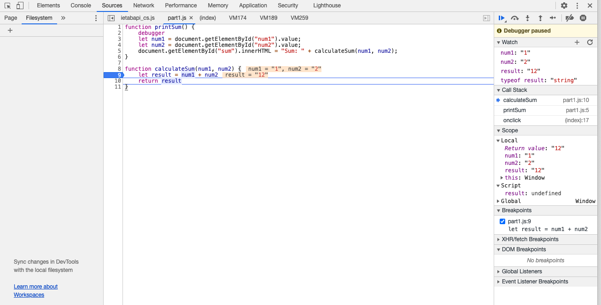
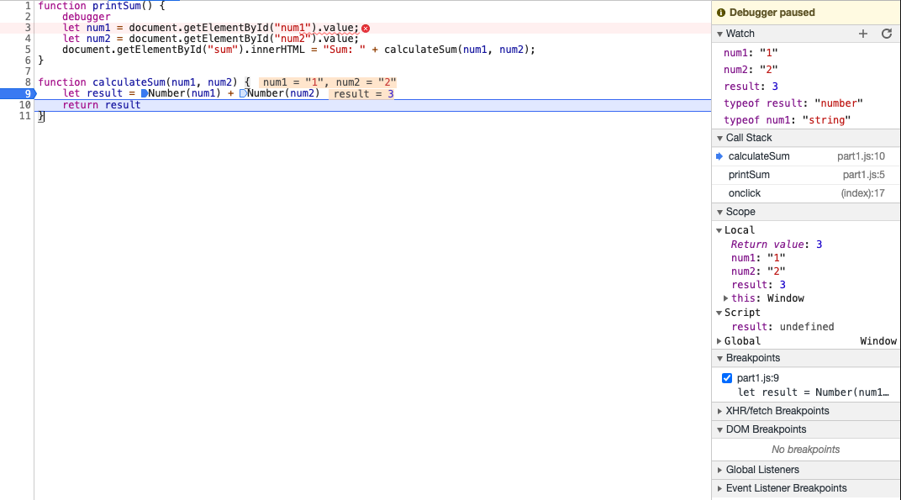

## Breakpoing and Watch Expression List




## Fixing the Issue

The bug is that ```num1 + num2``` in the original code is a concatenation of two strings.
To fix that, we need to convert num1 and num2 to ```Numbers``` before adding them.



## DevTools - Network Tab

1. Name of new json file: citylots.json
2. Initiator: part2.js
3. Size: 11.7 MB
4. Time took to downlowd: 2.21s
5. User Agent: Mozilla/5.0 (Macintosh; Intel Mac OS X 11_1_0) AppleWebKit/537.36 (KHTML, like Gecko) Chrome/88.0.4324.96 Safari/537.36
6. Server: Apache
7. Last-Modified: Tue, 26 Jan 2021 22:14:13 GMT
8. Content-Type: application/json
9. fetchData()